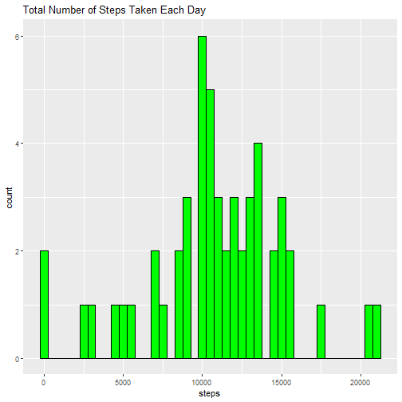
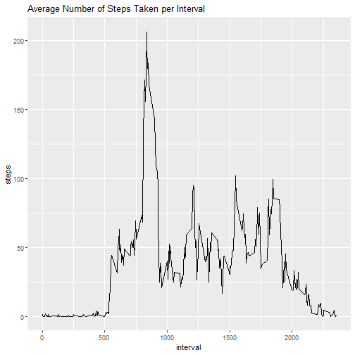
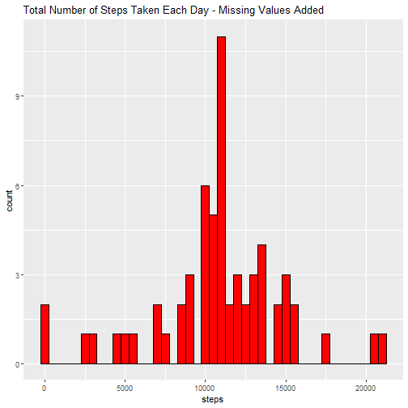
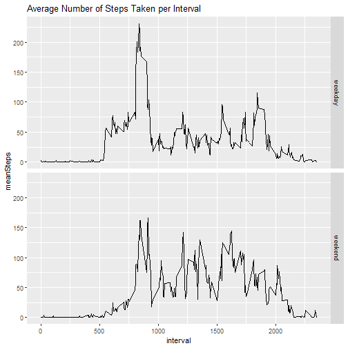

# Assignment
Benedikt Kortüm

## Loading and preprocessing the data
We will need to download, unzip and read the data file.


```r
library("ggplot2")
fileurl <- "https://d396qusza40orc.cloudfront.net/repdata%2Fdata%2Factivity.zip"
download.file(fileurl,"repdata-activity.zip")
unzip("repdata-activity.zip")
activity <- read.csv("activity.csv", header=TRUE)
head(activity)
```

```
##   steps       date interval
## 1    NA 2012-10-01        0
## 2    NA 2012-10-01        5
## 3    NA 2012-10-01       10
## 4    NA 2012-10-01       15
## 5    NA 2012-10-01       20
## 6    NA 2012-10-01       25
```

```r
sapply(activity,class)
```

```
##       steps        date    interval 
##   "integer" "character"   "integer"
```

Findings upon initial read-in: "steps" is an integer, contains NAs; "date" is a character, which prevents proper time-based analyses; "interval" is an integer.

Therefore, read.csv will be repeated, but this time we will set the column classes manually.


```r
activity <- read.csv("activity.csv", header=TRUE, colClasses = c("integer", "POSIXct", "integer"))
head(activity)
```

```
##   steps       date interval
## 1    NA 2012-10-01        0
## 2    NA 2012-10-01        5
## 3    NA 2012-10-01       10
## 4    NA 2012-10-01       15
## 5    NA 2012-10-01       20
## 6    NA 2012-10-01       25
```

```r
activityclean <- na.omit(activity)
head(activityclean)
```

```
##     steps       date interval
## 289     0 2012-10-02        0
## 290     0 2012-10-02        5
## 291     0 2012-10-02       10
## 292     0 2012-10-02       15
## 293     0 2012-10-02       20
## 294     0 2012-10-02       25
```


## What is mean total number of steps taken per day?

Calculate the total number of steps taken per day, report in a histogram.
Calculate and report the mean and median of the total number of steps taken per day.


```r
activity_per_day <- aggregate(steps~date,activityclean,sum)
ggplot(data = activity_per_day) + 
  geom_histogram(aes(steps),binwidth = 500, fill = "green", col = "black") + 
  ggtitle("Total Number of Steps Taken Each Day")
```



```r
mean(activity_per_day$steps)
```

```
## [1] 10766.19
```

```r
median(activity_per_day$steps)
```

```
## [1] 10765
```

## What is the average daily activity pattern?

Report in a times series plot.


```r
activity_per_interval <- aggregate(steps~interval, activityclean, mean)
ggplot(data = activity_per_interval) + 
     geom_line(aes(interval,steps)) +
     ggtitle("Average Number of Steps Taken per Interval")
```



### Which 5-minute interval, on average across all the days in the dataset, contains the maximum number of steps?

```r
activity_per_interval[which.max(activity_per_interval$steps),]
```

```
##     interval    steps
## 104      835 206.1698
```


## Imputing missing values

Note that there are a number of days/intervals where there are missing values (coded as NA\color{red}{\verb|NA|}NA). The presence of missing days may introduce bias into some calculations or summaries of the data.

Calculate and report the total number of missing values in the dataset (i.e. the total number of rows with NA\color{red}{\verb|NA|}NAs)


```r
colSums(is.na(activity))
```

```
##    steps     date interval 
##     2304        0        0
```


Create a new dataset that is equal to the original dataset but with the missing data filled in.

```r
activity_filled <- activity
activity_filled$steps <- ifelse(is.na(activity_filled$steps) == TRUE, activity_per_interval$steps[activity_per_interval$interval %in% activity_filled$interval], activity_filled$steps)
```


Make a histogram of the total number of steps taken each day.
Calculate and report the mean and median total number of steps taken per day.
Do these values differ from the estimates from the first part of the assignment? What is the impact of imputing missing data on the estimates of the total daily number of steps?


```r
activity_filled2 <- aggregate(steps~date, activity_filled,sum)
ggplot(data = activity_filled2) +
  geom_histogram(aes(steps), binwidth = 500, fill = 'red', col = 'black') +
  ggtitle("Total Number of Steps Taken Each Day - Missing Values Added")
```



```r
mean(activity_filled2$steps)
```

```
## [1] 10766.19
```

```r
median(activity_filled2$steps)
```

```
## [1] 10766.19
```

It was expected to see a minimal difference since we were replacing NA values with the average values. The mean and median are almost the same (median higher by 1 step), only the frequency on the histogram is not the highest on 10,000 steps but on 11,000 steps.

## Are there differences in activity patterns between weekdays and weekends?

For this part the weekdays() function may be of some help here. Use the dataset with the filled-in missing values for this part.
Create a new factor variable in the dataset with two levels – “weekday” and “weekend” indicating whether a given date is a weekday or weekend day.


```r
activity_filled$weekdayType <- ifelse(weekdays(activity_filled$date) 
                                      %in% c("Saturday", "Sunday"), "weekend", "weekday")

library(tidyverse)
activity_filled3 <- activity_filled %>% group_by(interval, weekdayType)  %>% summarise(meanSteps = mean(steps))
```

```
## `summarise()` has grouped output by 'interval'. You can override using the `.groups` argument.
```

```r
head(activity_filled3)
```

```
## # A tibble: 6 x 3
## # Groups:   interval [3]
##   interval weekdayType meanSteps
##      <int> <chr>           <dbl>
## 1        0 weekday        2.25  
## 2        0 weekend        0.215 
## 3        5 weekday        0.445 
## 4        5 weekend        0.0425
## 5       10 weekday        0.173 
## 6       10 weekend        0.0165
```
    

Make a panel plot containing a time series plot of the 5-minute interval (x-axis) and the average number of steps taken, averaged across all weekday days or weekend days (y-axis).
 
 

```r
activityplot <- ggplot(data = activity_filled3) + 
     geom_line(aes(interval,meanSteps)) +
     ggtitle("Average Number of Steps Taken per Interval")

activityplot + facet_grid(rows  = vars(weekdayType))
```


    
